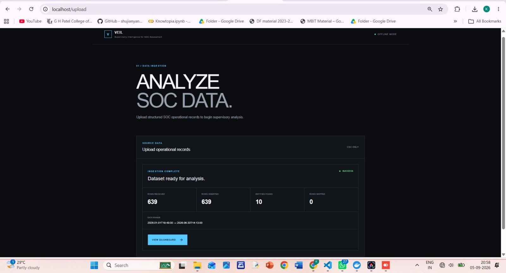
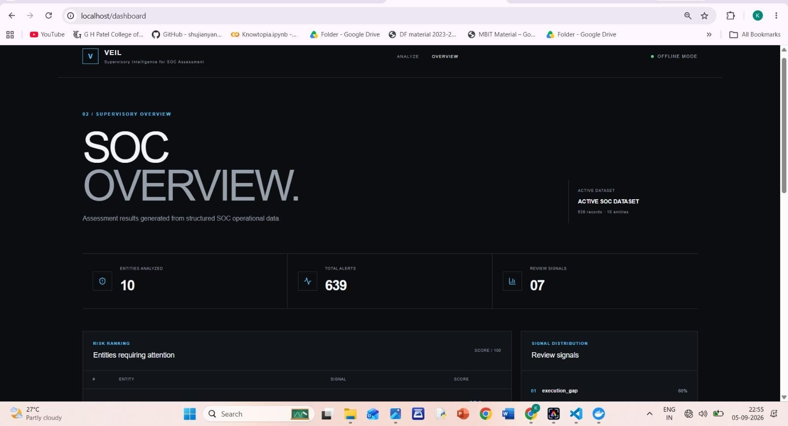
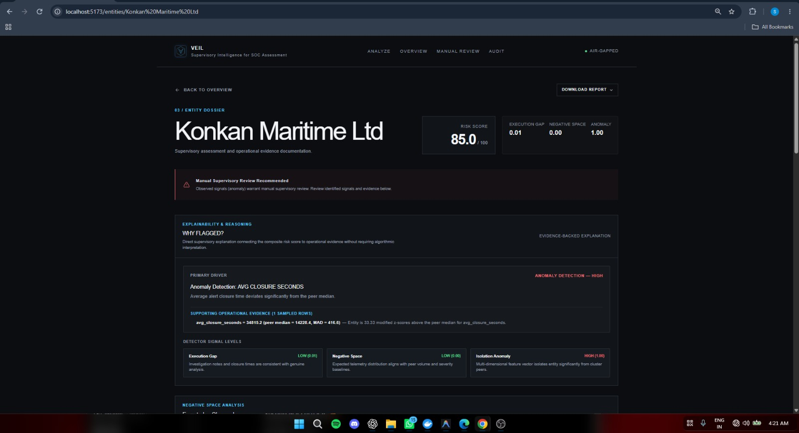
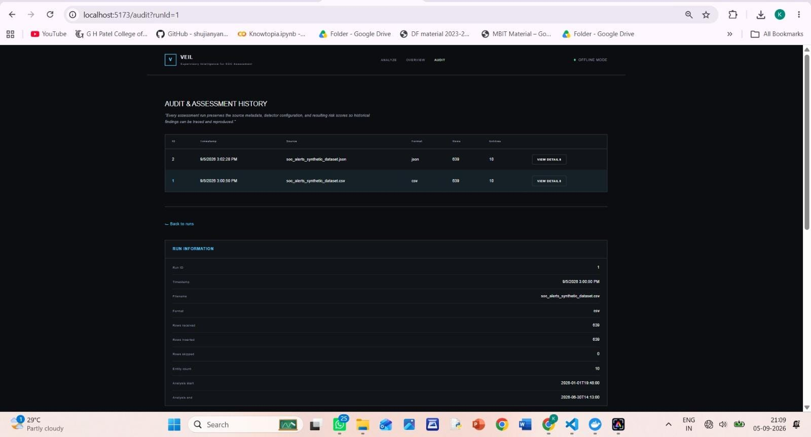
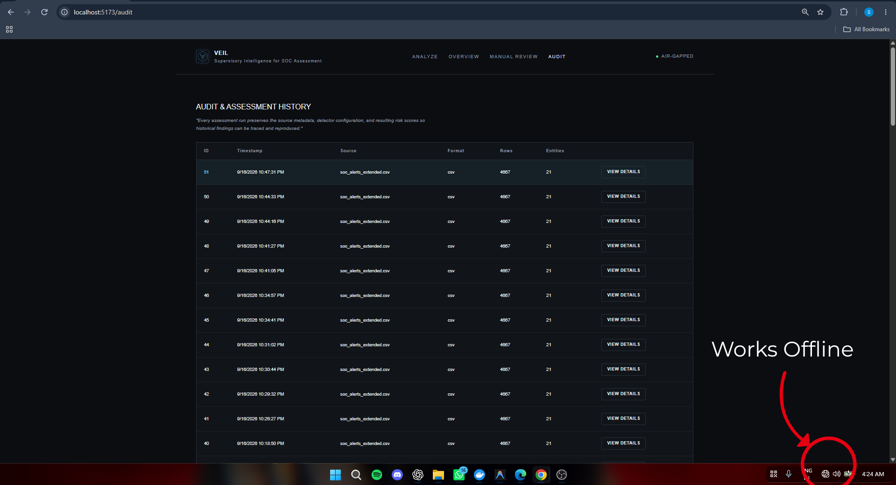

# SAT-SA — Supervisory Analytics Tool for SOC Assessment

**SIH26157** | Sponsoring Org: NTRO | Theme: Blockchain & Cybersecurity

NCIIPC needs a way to tell which organizations are doing SOC (Security Operations
Center) work for real versus just for show, without relying on self-reported
questionnaires. SAT-SA ingests an organization's raw SOC alert/case export (CSV, JSON,
or a SQLite database export) and runs three independent detectors — rule-based
execution-gap checks, a peer-baseline negative-space check, and an Isolation Forest
anomaly model — to produce one evidence-backed risk score per entity. It's built for
supervisory bodies (NCIIPC, sector regulators, internal audit teams) who need to
prioritize which organizations to audit first, from actual operational data rather
than a self-assessment survey.

Full architecture and methodology: [docs/ARCHITECTURE.md](docs/ARCHITECTURE.md).

---

## Quick start (Docker — primary path)

```bash
git clone <repo-url>
cd SIH26157-SAT-SA
docker compose up --build
```

- Frontend: **http://localhost**
- Backend API: **http://localhost:8000** (proxied through the frontend at `/api/`)

That's it — upload `dataset/soc_alerts_extended.csv` (or your own file) from the
Analyze page and the dashboard populates. No other setup, no external services, no
internet access needed once the images are built.

## How it works

**1. Upload.** Submit a CSV, JSON, or SQLite (`.db`/`.sqlite`) export of an
organization's SOC alert data from the Analyze page. Ingestion replaces the current
alert set and kicks off a fresh assessment run, which is what the Audit trail records.


*Analyze page: file picker and upload status for a CSV/JSON/DB alert export.*

**2. Assess.** All three detectors run against the uploaded data and combine into one
risk score per entity, shown ranked on the dashboard. Each row also carries a
risk band and a primary driver, so the highest-priority entities surface immediately.
From here a supervisor can also open a cross-entity **priority list of individual
alerts** (ranked on rule-citation count, entity risk, and severity — see
[docs/ARCHITECTURE.md](docs/ARCHITECTURE.md)) and each entity's **risk trend** across
past assessment runs.


*Dashboard: entities ranked by risk score, with risk band and primary driver.*

**3. Drill down.** Click into any entity to see its three component scores broken out,
plus the concrete evidence behind them — cited `alert_id`s, peer-comparison strings,
and an expected-vs-observed peer benchmark for every underlying metric. Nothing is
flagged without a reason attached.


*Drill-down: component scores, cited evidence, and peer benchmark comparison.*

**4. Manual review (blind).** A human supervisor can independently assess any entity
from the same raw evidence VEIL saw — alert counts, closure times, escalation rates,
investigation notes — with every VEIL conclusion (risk score, band, driver) withheld
until *after* the reviewer submits their own verdict. Only then does the page reveal
VEIL's output and an agreement comparison across concern, priority, and recommendation.
Every review is kept, so a re-reviewed entity accumulates history rather than
overwriting it.

**5. Export.** Both the dashboard and any entity's drill-down page can download a
report — PDF, JSON, or CSV — assembled client-side from the same data already on
screen, so no separate backend call or extra network exposure is needed.

**6. Audit.** Every upload is preserved as a historical run — timestamp, source file,
ingestion counts, the exact detector configuration in force, and the resulting scores —
so a supervisor can revisit or reproduce any past assessment.


*Audit page: list of past assessment runs with their configuration snapshots.*

## Manual setup (alternative)

**Backend** (Python 3.11+):
```bash
cd backend
python -m venv venv
source venv/bin/activate        # Windows: venv\Scripts\activate
pip install -r requirements.txt
uvicorn app.main:app --reload --port 8000
```
API is live at `http://localhost:8000` (docs at `http://localhost:8000/docs`).

**Frontend** (Node 20+), in a separate terminal:
```bash
cd frontend
npm install
npm run dev
```
App is live at `http://localhost:5173`, and already points at `http://localhost:8000/api`
by default (no `.env` needed for local dev).

---

## Data format

Upload a `.csv`, `.json`, `.db`, or `.sqlite` file. JSON must be either a top-level
array of alert objects, or `{"alerts": [...]}`. A `.db`/`.sqlite` export is opened
read-only and searched for a table named `alerts`, falling back to any table whose
columns are a superset of the 8 required fields — a clean 400 names every table found
and what's missing if none qualify. Every alert needs these 8 fields, regardless of
source format:

| Column | Description |
|---|---|
| `alert_id` | Unique per company — two companies may reuse the same ID |
| `entity_name` | The organization the alert belongs to |
| `severity` | `critical` / `high` / `medium` / `low` (case-insensitive) |
| `created_time` | When the alert fired, `YYYY-MM-DD HH:MM:SS` |
| `closed_time` | When it was closed, same format — blank/omitted if still open |
| `escalated` | `yes`/`no` (also accepts `true`/`false`, `1`/`0`) |
| `investigation_notes` | Free-text analyst notes — blank is valid and meaningful |
| `asset_type` | e.g. `Server`, `Database`, `Endpoint`, `Network Device` |

**CSV example:**
```csv
alert_id,entity_name,severity,created_time,closed_time,escalated,investigation_notes,asset_type
ALT00627,Jupiter Aviation Control,low,2026-01-01 19:48:00,2026-01-02 00:33:00,no,"Correlated with SIEM logs, escalated.",Database
```

**JSON example:**
```json
{
  "alerts": [
    {
      "alert_id": "ALT00627",
      "entity_name": "Jupiter Aviation Control",
      "severity": "low",
      "created_time": "2026-01-01 19:48:00",
      "closed_time": "2026-01-02 00:33:00",
      "escalated": "no",
      "investigation_notes": "Correlated with SIEM logs, escalated.",
      "asset_type": "Database"
    }
  ]
}
```

## API

Every response is JSON; the full request/response schema for each endpoint is at
**`/docs`** (Swagger UI) once the backend is running.

| Method | Path | Purpose |
|---|---|---|
| `GET` | `/api/health` | Liveness check + current ingested alert count |
| `POST` | `/api/upload` | Upload a CSV/JSON/`.db`/`.sqlite` file, replacing the current alert set |
| `GET` | `/api/risk-scores` | Every entity ranked by risk score (dashboard view) |
| `GET` | `/api/entities/{entity_name}` | Full drill-down for one entity — component scores, findings, evidence, expected-vs-observed peer metrics |
| `GET` | `/api/priority-samples` | Cross-entity ranked list of individual alerts, for supervisory sampling (req. #10) |
| `GET` | `/api/trends` | Trend direction (improving/deteriorating/volatile/stable) for every entity across past runs |
| `GET` | `/api/trends/{entity_name}` | Full risk-score history + trend detail for one entity |
| `GET` | `/api/audit/runs` | List every past assessment run (audit trail) |
| `GET` | `/api/audit/runs/{run_id}` | Full audit record for one run — config snapshot + results at that point in time |
| `GET` | `/api/manual-review/entities` | Entities available for blind review — name + alert count only, no VEIL conclusion |
| `GET` | `/api/manual-review/{entity_name}/evidence` | Blind evidence dossier for one entity — raw alerts/aggregates, no score |
| `POST` | `/api/manual-review` | Submit a supervisor's independent review for one entity |
| `GET` | `/api/manual-review/{entity_name}` | Full review history for one entity |
| `GET` | `/api/manual-review/{entity_name}/comparison` | Latest review vs. VEIL's output for one entity, once a review exists |
| `GET` | `/api/manual-review/metrics` | Aggregate manual-vs-VEIL agreement rates across every submitted review |

Report export (PDF/JSON/CSV) has no dedicated endpoint — it's assembled entirely
client-side from data the dashboard/drill-down pages already fetched (see
`frontend/src/lib/assessmentReport.js` and `pdfReportBuilder.js`).

## Running the tests

```bash
cd backend
pip install -r requirements.txt   # if not already done
pytest tests/ -v
```
85 tests covering all three detectors, the risk-score combiner, trend direction,
priority sampling, the blind manual-review workflow, and CSV/JSON/SQLite ingestion.
`backend/pytest.ini` scopes discovery to `tests/` only.

## Repo layout

```
SIH26157-SAT-SA/
├── backend/app/
│   ├── main.py, database.py, models.py, schemas.py
│   ├── routers/           # ingestion.py (upload), analytics.py (risk-scores, entities,
│   │                       #   priority-samples, trends, audit), manual_review.py
│   └── analytics/          # execution_gap.py, negative_space.py, anomaly.py,
│                            #   risk_score.py, sample_priority.py, expected_observed.py
├── backend/tests/         # pytest suite (85 tests)
├── frontend/src/          # React pages (Landing, Upload, Dashboard, DrillDown, Audit,
│                           #   ManualReview) + client-side report export (lib/assessmentReport.js,
│                           #   lib/pdfReportBuilder.js)
├── dataset/                # soc_alerts_extended.csv (primary, 4,667 alerts / 21 entities)
│                            #   + soc_alerts_synthetic_dataset.csv (secondary, 639/10)
│                            #   + periods/ (4 quarterly datasets for trend validation)
├── docs/ARCHITECTURE.md    # solution architecture, formulas, validation methodology
└── docker-compose.yml
```

## Results

The primary dataset (`dataset/soc_alerts_extended.csv`) has 4,667 alerts across 21
entities, 7 of which have intentionally seeded supervisory-failure patterns (2
execution-gap, 2 negative-space, 2 anomaly, 1 borderline-mild) against 14 normal
baselines. **All 7 seeded entities land in the top 7 by risk score**, verified against a
held-out answer key (see [docs/ARCHITECTURE.md §6](docs/ARCHITECTURE.md)):

| Entity | Risk Score | Band |
|---|---|---|
| Konkan Maritime Ltd | 85.0 | critical |
| Meridian Trust Bank | 82.5 | critical |
| Saraswati Rail Network | 69.4 | high |
| Kaveri Power Holdings | 47.1 | high |
| Arcadia Defence Systems | 40.1 | medium |
| Deccan Health Network | 32.0 | medium |
| Nilgiri Water Authority | 24.6 | medium |
| *(remaining 14 baseline entities)* | ≤ 15.9 | low |

The original 639-alert / 10-entity dataset
(`dataset/soc_alerts_synthetic_dataset.csv`) remains available as a secondary,
smaller demo set with its own held-out answer key.

## Offline

SAT-SA runs fully offline — no external API calls, no cloud services, no third-party
LLM dependency at runtime. Everything (ingestion, both rule-based detectors, and the
Isolation Forest model) runs locally against the SQLite file.


*The app running end-to-end (upload → dashboard) with the host's network/Wi-Fi
disabled, as evidence of the offline claim.*
